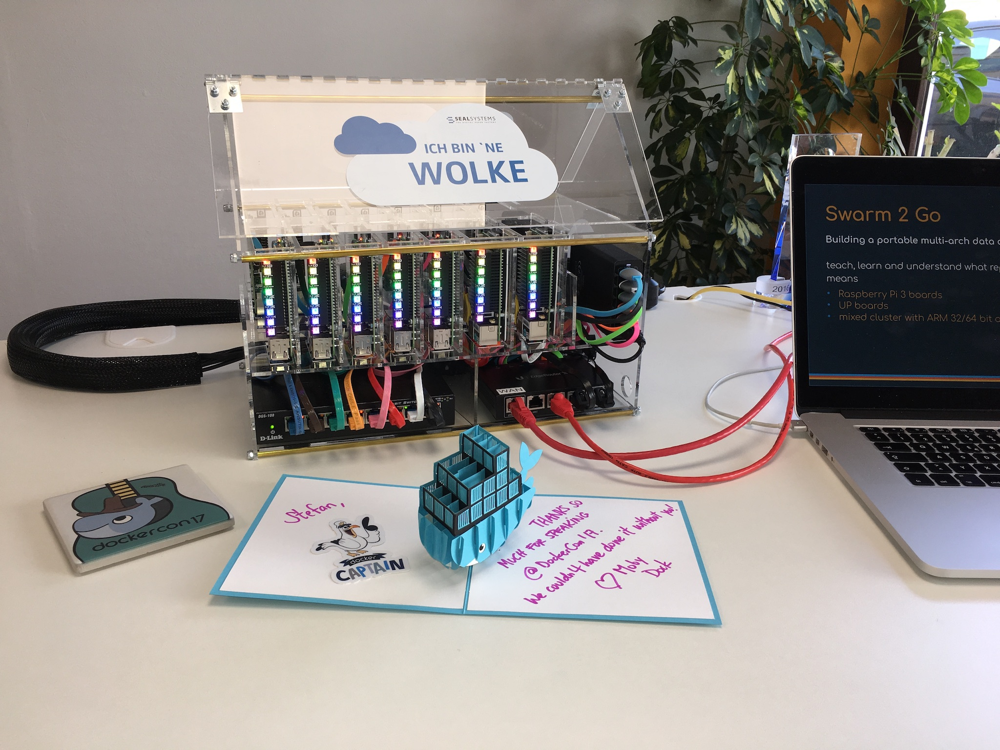

# tiny-cloud

Build a tiny cloud for demonstration purposes with Raspberry Pi's and UP boards.

Our tiny cloud setup is

- 5x Raspberry Pi 3, ARMv8 64bit CPU, 1GByte RAM, 16 GByte SD card
- 2x UP board, Intel Atom 64bit CPU, 4GByte RAM, 32 GByte eMMC

## DockerCon

I spoke at DockerCon 2017 about our tiny cloud and showed it there.
See sub folder `dockercon` for all scripts used for the live demo.

The slides are [online](https://www.slideshare.net/stefscherer/swarm-2-go-build-a-portable-multiarch-data-center-with-pi-and-up-nodes).
